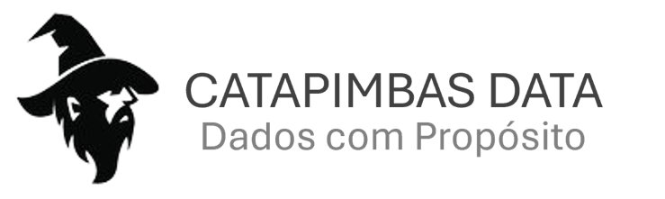
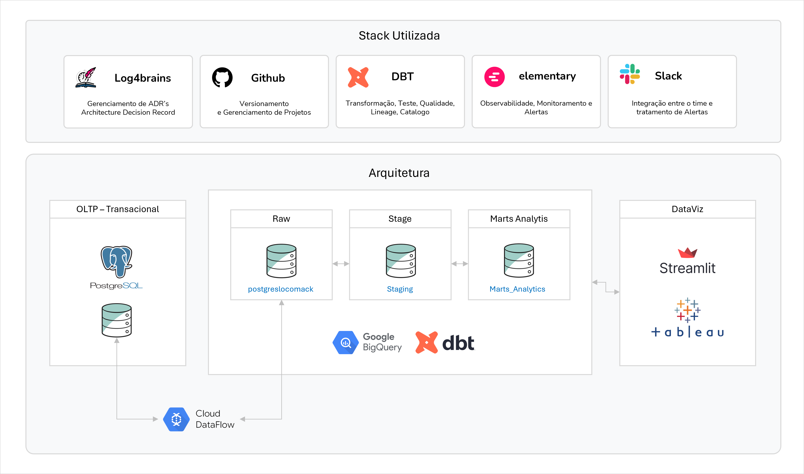

# Projeto do MBA de Engenharia de Dados

## Projeto de previsão de venda

---

### Desafio do Projeto
O projeto proposto pelos professores do curso de MBA em Engenharia de Dados da Universidade Mackenzie consiste em criar um processo completo de ingestão, transformação e análise de dados de vendas, resultando na criação de um modelo de previsão de vendas e um dashboard interativo.

### Integrantes
| Nome               | Função                                              |
|--------------------|-----------------------------------------------------|
| Carolina Attili    | Data Governance                                     |
| Henrique Arduinni  | Data Engineer e Devops                              |
| Matheus Vieger     | Data Engineer                                       |
| Rafael Medeiros    | Product Manager, Data Engineer e Analytics Engineer |

---

# Empresa

Resultados surpreendentes a partir dos seus dados!

Somos uma empresa que te ajuda a encontrar valor nos seus dados e te surpreende com resultados.

**Estratégia de Dados da Catapimbas Data para Previsão de Vendas**

**Visão Geral:**
Na Catapimbas Data, reconhecemos a importância crucial dos dados para impulsionar as operações e as decisões de negócios no setor de vendas. Nossa missão é fornecer soluções de machine learning de ponta que capacitem nossos clientes a prever com precisão as vendas, otimizar inventários e aumentar a eficiência operacional.

**Objetivos Estratégicos:**
1. **Precisão na Previsão de Vendas:** Desenvolver modelos de machine learning altamente precisos que prevejam as vendas com base em dados históricos, sazonalidade, tendências do mercado e variáveis ​​externas relevantes.
   
2. **Otimização de Inventário:** Utilizar análises preditivas para determinar os níveis ideais de estoque, minimizando assim os custos associados ao excesso ou à escassez de produtos.

3. **Personalização do Atendimento ao Cliente:** Utilizar dados para entender melhor o comportamento do cliente e oferecer recomendações personalizadas, impulsionando a fidelidade e as vendas repetidas.

4. **Agilidade e Escalabilidade:** Desenvolver uma infraestrutura de dados ágil e escalável que suporte a rápida análise e processamento de grandes volumes de dados, garantindo que nossos modelos sejam adaptáveis ​​e eficazes em ambientes em constante mudança.

**Abordagem Técnica:**
1. **Coleta de Dados Abrangente:** Implementar processos para coletar dados de vendas, estoques, comportamento do cliente e variáveis ​​externas relevantes, como clima, feriados e eventos sazonais.

2. **Limpeza e Preparação de Dados:** Realizar uma limpeza rigorosa dos dados, identificando e corrigindo inconsistências, outliers e lacunas, além de transformar os dados em formatos adequados para análise.

3. **Seleção de Recursos:** Identificar os recursos mais relevantes e significativos para a previsão de vendas, utilizando técnicas de seleção de recursos e análise exploratória de dados.

4. **Desenvolvimento de Modelos:** Implementar uma variedade de algoritmos de machine learning, como regressão linear, árvores de decisão, redes neurais e modelos de séries temporais, otimizando sua performance por meio de validação cruzada e ajuste de hiperparâmetros.

5. **Validação e Teste:** Validar a precisão e a robustez dos modelos usando conjuntos de dados de teste independentes e avaliando métricas de desempenho, como erro médio absoluto (MAE) e erro médio percentual absoluto (MAPE).

**Governança de Dados:**
1. **Segurança e Privacidade:** Garantir a conformidade com regulamentações de proteção de dados, como a LGPD no Brasil, GDPR na Europa, e outras regulamentações relevantes, implementando medidas de segurança rigorosas para proteger a privacidade e a integridade dos dados do cliente. 

2. **Ética e Transparência:** Adotar práticas éticas de coleta e uso de dados, garantindo transparência no processo de modelagem e comunicação clara sobre como os dados são usados e interpretados.

3. **Qualidade e Integridade dos Dados:** Estabelecer padrões de qualidade de dados e processos de monitoramento contínuo para garantir a integridade e a confiabilidade dos dados ao longo do tempo.

**Implementação e Suporte:**
1. **Integração com Sistemas Existentes:** Trabalhar em estreita colaboração com os clientes para integrar nossos modelos de previsão de vendas em seus sistemas de gestão de estoque e vendas existentes, garantindo uma transição suave e uma adoção eficaz.

2. **Treinamento e Capacitação:** Oferecer treinamento e suporte especializado para os usuários finais, capacitando-os a interpretar e utilizar efetivamente os insights gerados pelos modelos de machine learning.

3. **Monitoramento Contínuo:** Implementar sistemas de monitoramento contínuo para acompanhar o desempenho dos modelos em produção, identificar desvios e oportunidades de melhoria e garantir que os modelos permaneçam precisos e relevantes ao longo do tempo.

**Conclusão:**
Na Catapimbas Data, estamos comprometidos em fornecer soluções de dados de classe mundial que capacitam nossos clientes a tomar decisões informadas e impulsionar o sucesso no competitivo mercado de vendas. Com uma abordagem centrada em dados, expertise técnica e um compromisso com a excelência, estamos prontos para enfrentar os desafios mais exigentes e ajudar nossos clientes a alcançarem novos patamares de sucesso.

## Repositórios:
- [Documentação e Gerenciamento de ADRs](https://github.com/techmackcrazy/ml-sales-prediction)

- [Transformação dos dados DBT Cloud](https://github.com/techmackcrazy/dbt-mack-sales-prediction)

## Objetivos
1. **Ingestão de Dados**: Desenvolver um pipeline para coletar e armazenar dados de vendas de diversas fontes.
2. **Transformação de Dados**: Aplicar transformações necessárias para limpar e preparar os dados para análise.
3. **Data Governance**: Aplicar conceitos e diretrizes de governança de dados.
4. **Modelo de Previsão de Vendas**: Criar e treinar um modelo preditivo para estimar futuras vendas.
5. **Dashboard**: Construir um dashboard para visualizar as tendências de vendas e previsões.

## Escopo do Projeto
- **Fontes de Dados**: Dados de vendas históricas, dados de mercado, dados demográficos, etc.
- **Ferramentas Utilizadas**:

    - **[WSL (versão 2)](https://learn.microsoft.com/pt-br/windows/wsl/about)**: É uma camada de compatibilidade desenvolvida pela Microsoft que permite rodar um ambiente GNU/Linux diretamente no Windows, sem a necessidade de máquinas virtuais ou configuração de dual-boot. Com o WSL, os usuários podem executar binários Linux nativos em uma interface de linha de comando Windows.
 
    - **[Git](https://www.atlassian.com/git)**: Versionamento do projeto.
    
    - **[Git Flow Extension](https://www.atlassian.com/git/tutorials/comparing-workflows/gitflow-workflow)**: É um conjunto de scripts e práticas que facilitam a implementação de um modelo de ramificação (branching) bem estruturado no Git.
    
    - **[ssh-keygen](https://en.wikipedia.org/wiki/Ssh-keygen)**: Uma ferramenta de linha de comando usada para gerar, gerenciar e converter chaves de autenticação SSH (Secure Shell). SSH é um protocolo que permite a comunicação segura entre dispositivos na rede, e as chaves SSH são usadas para autenticação baseada em chave pública, uma forma mais segura e conveniente de autenticação comparada ao uso de senhas.
    
    - **[log4brains](https://github.com/thomvaill/log4brains)**: Ferramenta para gerenciar registros de decisões arquiteturais (ADRs).
    
    - **[Dataflow](https://cloud.google.com/dataflow/docs/overview?hl=pt-br)**: Google Cloud Dataflow é um serviço gerenciado para processamento de dados em tempo real e em lote. Utiliza o modelo de programação do Apache Beam para desenvolver pipelines unificados que podem ser escritos em Java e Python. 
    
    - **[dbt cloud](https://www.getdbt.com/product/dbt-cloud)**: Ferramenta para transformação de dados que permite modelar, transformar e documentar os dados de forma eficiente.

    - **[Elementary](https://www.elementary-data.com/)**: Solução nativa de observabilidade de dados para engenheiros de dados e analytics.

    - **[Slack](https://api.slack.com/docs)**: A plataforma Slack oferece muitas ferramentas para ajudar a aprimorar seus workspaces. Em um nível mais alto, elas podem ser vistas através da lente das automações de fluxo de trabalho e dos aplicativos Slack que não são de fluxo de trabalho.

- **Período de Execução**: 2 meses.

## Arquitetura de Dados

- **Ingestão**: Utilização do Cloud Data Flow para orquestrar a coleta de dados de várias fontes e armazenamento em um data lake.
- **Transformação**: DBT para aplicar transformações e criar modelos de dados limpos e preparados.
- **Modelo de Previsão**: Uso de Streamlit para a criação rápida de aplicativos web para visualização de dados, prototipagem e implementação de modelos de machine learning.
- **Visualização**: Tableau para criar dashboards interativos.

## Processo de Ingestão de Dados
1. **Coleta**: Dados são coletados de diversas fontes, incluindo APIs, arquivos CSV e bancos de dados.
2. **Armazenamento**: Dados brutos são armazenados em um data lake para processamento posterior.
3. **Orquestração**: Cloud Data Flow gerencia o fluxo de trabalho de ingestão e armazenamento dos dados.

## Transformação de Dados
1. **Limpeza**: Remoção de dados duplicados, tratamento de valores nulos e padronização de formatos.
2. **Enriquecimento**: Combinação de dados de diferentes fontes para adicionar valor aos dados de vendas.
3. **Modelagem**: Criação de tabelas dimensionais e fato para análise eficiente (star schema).

## Modelo de Previsão de Vendas
1. **Preparação dos Dados**: Separação dos dados em conjuntos de treino e teste.
2. **Treinamento do Modelo**: Uso de algoritmos de machine learning para treinar o modelo preditivo.
3. **Validação**: Avaliação do modelo utilizando métricas de performance e ajuste fino.

## Dashboard
1. **Visualização de Tendências**: Gráficos e tabelas mostrando as tendências históricas de vendas.
2. **Previsões**: Gráficos de previsão mostrando estimativas de vendas futuras.
3. **Interatividade**: Filtros e opções de drill-down para explorar os dados em detalhes.

## Conclusão
Este projeto integra várias etapas de engenharia de dados, desde a coleta e transformação de dados até a criação de modelos preditivos e visualizações. O objetivo é fornecer uma solução completa e eficiente para análise e previsão de vendas, utilizando ferramentas modernas e práticas recomendadas na indústria.

---

# Dashboard

